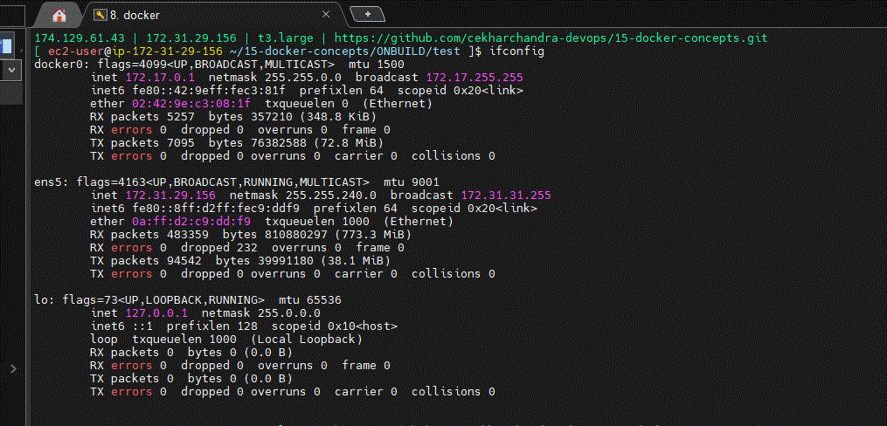

# docker networking




Docker Network:

in the above screenshot AWS ISP provides internet to our server.
every VM get access to internet from AWS ISP and IP address is 172.31.29.156  

docker created one virtual network that is docker0, it acts like modem to the containers inside VM. docker0 will allocate IP address to containers.

this is called bridge network.

 

docker containers cant be communicated using default network.
```
docker network --hlep

docker network create expense  --> bridge network

docker network ls

ifconfig

docker network connect expense mysql

docker network disconnect bridge msyql

docker run -d network expense --name backend backend:v1

apt update

apt install telnet

telnet mysql 3306

apt remove telnet -y

docker run -d -p 80:80 --network expense --name frontend frontend:v1
```
# deploy expense apps as docker containers

By default, containers can't communicate with each other using the default bridge network. We need to create our own network and connect each container to that network to enable communication between them.


```
  docker network ls
  docker network create expense
  docker docker network connect expense mysql
  docker network connect expense mysql
  ifconfig
  docker inspect mysql
  docker network ls
  docker network --help
  docker network disnconnect bridge mysql
  docker network disconnect bridge mysql
  docker inspect mysql
  docker run --help
  docker run -d --name backend --network expense backend:v1
```

Created the `expense` network, then disconnected MySQL from the default network and added it to the `expense` network.

Similary, backend container added to expense network.


```
docker compose up -d
docker compose down
```